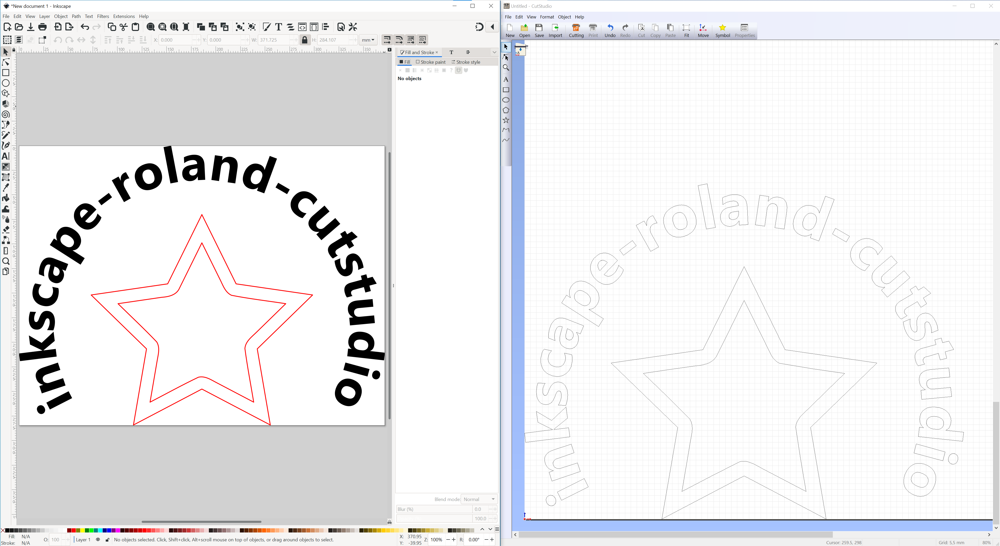
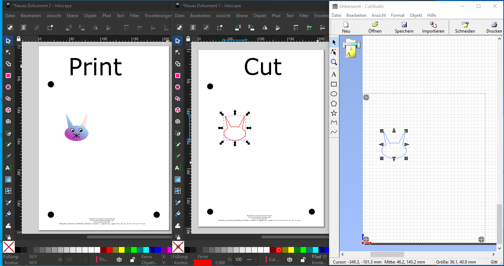
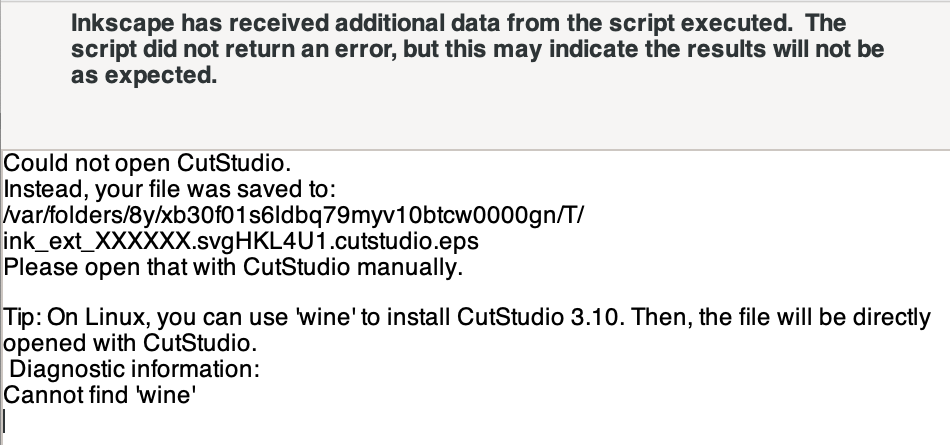

# inkscape-roland-cutstudio

[Inkscape][] plugin that converts SVG files to an EPS format that Roland's [CutStudio][] software can read.

    

[Inkscape]: https://www.inkscape.org/
[CutStudio]: https://www.rolanddga.com/products/software/roland-cutstudio-software

## Usage

### Using with CutStudio installed

#### Normal Use

1. Open Inkscape.
2. Select the objects you want to export to CutStudio. If no objects are selected, everything in the file will be exported.
3. Open the Extensions menu, then select Roland CutStudio -> Open in CutStudio. Selecting 'Open in CutStudio (mirror horizontal ◢|◣)' will horizontally mirror all objects.

#### Cropmarks

For plotters that support it (e.g., Roland GX-24), you can use cropmarks to align cut lines to a custom printed page, e.g., for printing and cutting stickers.

    

Before using this option, CutStudio must be set up so that normal use works properly. (CutStudio remembers the previously selected plotter and does strange things if you selected a device that can not plot).

1. Open Inkscape, create a new blank file.
2. Open the Extensions menu, then select Roland CutStudio -> Insert Cropmarks.
3. ~~You now have an example file with DIN A4 pagesize and crop marks that should work on a Roland GX-24 (and hopefully many other plotters). Changing the page size and cropmark position is currently not possible.~~
    You can edit the example file by Extensions -> Roland CutStudio -> Roland Cropmark Editor.
4. Choose your machine and paper size
5. The following explanation uses separate layers for printing and drawing. You can also do it in a different way.
6. Draw your print graphics on the layer "Print graphics". Remove the "Remove me" placeholder.
5. Copy/draw your cut lines on the layer "Cut lines".
6. Hide the helper layer once you are finished designing.
7. Hide the layer "Cut Lines". Print the print graphics on your printer, including the black cropmark circles.
8. Unhide the layer "Cut lines".
9. Select all cut lines: Click on the layer "Cut lines" in the Layers dialog. Then use "Edit - Select all".
10. Open the Extensions menu, then select -> Roland CutStudio -> Open in CutStudio.

Now CutStudio should display your file together with gray circles for the cropmarks. Note that you must have the correct plotter selected in the CutStudio "Cut settings".

Note that sometimes CutStudio remembers the cropmark setting even for the next file and even after closing CutStudio. You need to uncheck "Print and Cut" in the CutStudio menu if you later want to do normal plotting again.

### Using without CutStudio installed

Follow the steps above. Once the plugin has completed the export, you'll see a dialog box (example shown below) that indicates where the EPS file has been saved. This file can be imported into CutStudio with File -> Import.

    

## Installing

1. Obtain the files by either cloning this repository or [downloading the repository zip file][zip].
2. Unzip if required and copy all files starting with `roland\_` to the appropriate Inkscape extensions folder:
    1. For per-user installation: open Inkscape's preferences (Edit -> Preferences, or Inkscape -> Preferences on macOS). Under the System tab, look for 'User extensions' and then navigate to that location or click the 'Open' button.
    2. To install system-wide: open the same preferences tab. The correct folder is listed further down under 'Inkscape extensions'.
3. Restart Inkscape.

[zip]: https://github.com/mgmax/inkscape-roland-cutstudio/archive/refs/heads/master.zip

### Installation notes

- On Windows, CutStudio must be installed in the default path - `C:\Program Files\CutStudio` or `C:\Program Files (x86)\CutStudio`.
- CutStudio can be installed on Linux using WINE, but will probably not work for actually controlling Roland cutters.

### Inkscape versions < 1.2

Inkscape 1.2 [replaced verbs with actions][1.2notes], changing the way this plugin works. If you're using a version of Inkscape earlier than 1.2 you can get older versions of this plugin from the [releases page][releases]. Note that the installation instructions may be different, so please check the readme in the downloaded ZIP file.

[1.2notes]: https://wiki.inkscape.org/wiki/index.php/Release_notes/1.2#Command_line
[releases]: https://github.com/mgmax/inkscape-roland-cutstudio/releases

## Known issues

- Clipping of paths doesn't work. This can be worked around by using boolean operations to produce the actual path you want to cut before running the plugin.
- If there are any objects with opacity less than 100%, Inkscape exports them as bitmaps and they will not appear in CutStudio. This also occurs if the alpha value of the stroke or fill color is less than 100%.
- Filters (e.g. blur) are also exported as bitmaps, so are not supported.

These issues won't be fixed as there's a workaround for the first issue and CutStudio has no way of handling bitmaps.

If you find other issues, please report them [on GitHub][gh-issues].

## Contributing

I am sorry that the code is so horrible. If anyone feels the desire to burn everything and rewrite it from scratch, please feel free to do so. If you're making changes to the code, please make sure that `python3 roland_cutstudio.py --selftest` works before you submit a pull request.

[gh-issues]: https://github.com/mgmax/inkscape-roland-cutstudio/issues

## Details

CutStudio has a very crude EPS parser that only works with files exported from certain versions of Corel Draw and Adobe Illustrator. Specifically, it only knows these commands:

- moveto: `1 2 m`
- lineto: `1 2 l`
- curveto: `1 2 3 4 5 6 c`

It's not known if groups are possible (this plugin ungroups all objects before export), and closing paths has to be done by repeating the first point.
